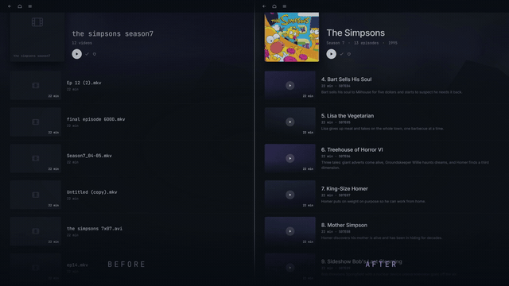
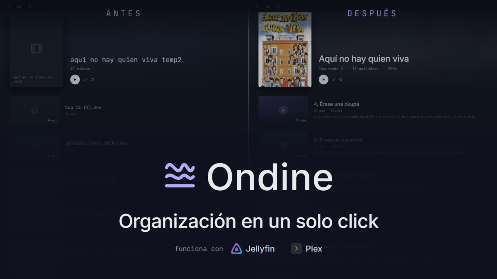
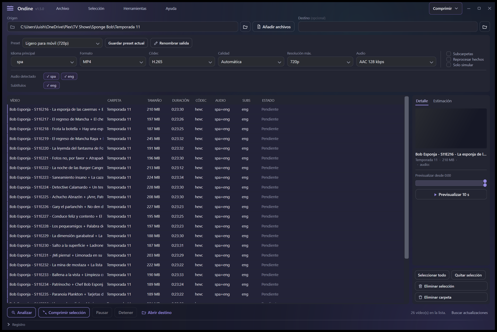
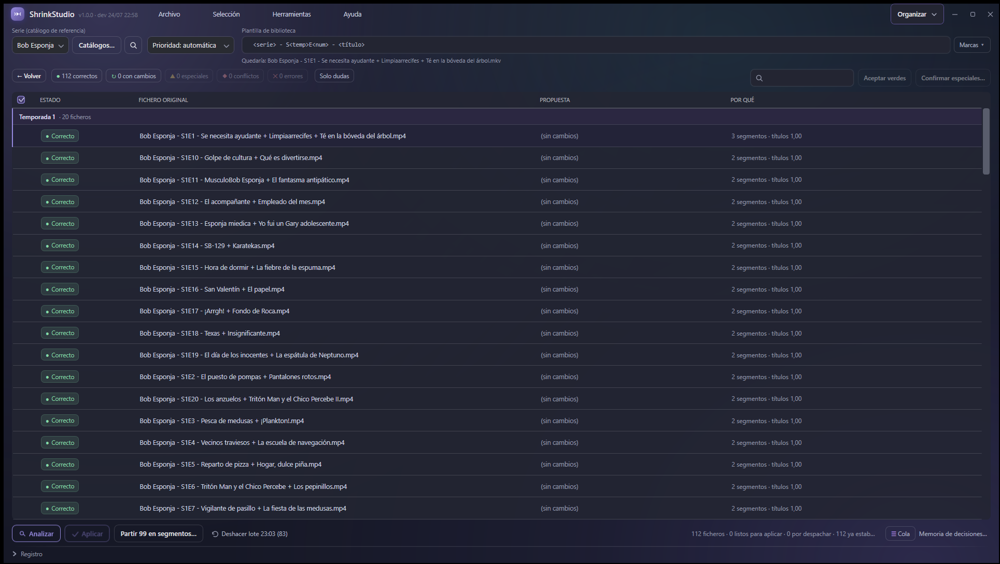
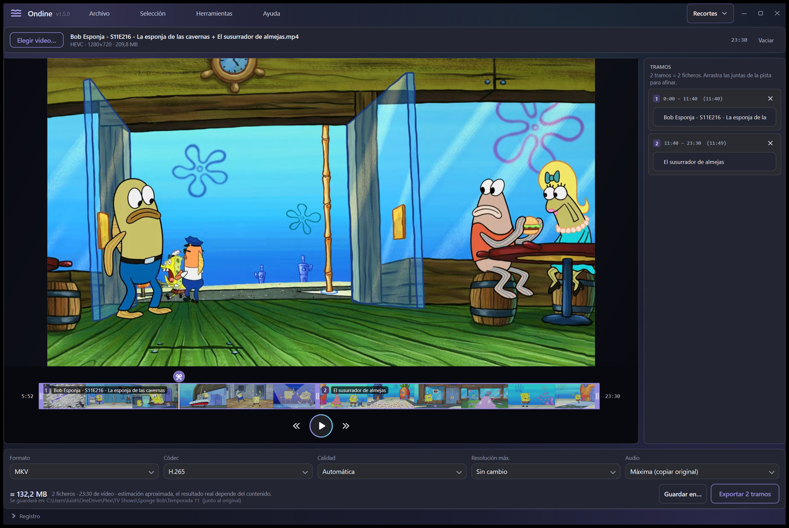

<p align="center">
  
</p>

<h1 align="center">Ondine</h1>

<p align="center">
  <b>Lo que pasas antes de que Plex escanee.</b>
</p>

<p align="center">
  Plex, Jellyfin y Kodi enseñan una biblioteca preciosa — pero solo si los ficheros ya están
  bien nombrados y colocados. Cuando no lo están, se rinden: el episodio sale como
  «Desconocido», la película se confunde con otra, o directamente no aparece.
  Ondine es la herramienta que pasas <b>antes</b>.
</p>

<p align="center">
  <b>App de escritorio para Windows</b> · <b>herramienta de terminal para Linux, macOS y Windows</b>
</p>

<p align="center">
  <b>Español</b> · <a href="README.md">English</a>
</p>

---

<p align="center">
  
</p>

<p align="center">
  <i>La misma carpeta, antes y después. A la izquierda, lo que el servidor pudo sacar de ella;
  a la derecha, lo que saca cuando ha pasado Ondine.</i>
</p>

<p align="center">
  <a href="https://ondine.hdglabs.com/es/">
    
  </a>
  <br>
  <i>Cuarenta y cuatro segundos · <a href="https://ondine.hdglabs.com/es/">se reproduce en ondine.hdglabs.com</a></i>
</p>

---

Tres cosas, y las tres suben la **calidad del dato** de tu biblioteca:

- **Comprimir** — para que quepa. Reduce típicamente **un 80–90 %** manteniendo muy buena calidad
  visual, con aceleración por hardware. Antes de empezar te enseña un **pronóstico** del tamaño
  final, y si quieres afinarlo puede **medirlo de verdad** codificando muestras cortas. También
  sabe **quitar doblajes y subtítulos sin recomprimir**: un episodio de 155 MB baja a 134 MB en
  0,6 s, con el vídeo **idéntico bit a bit**.
- **Organizar** — para que el servidor la reconozca. Identifica cada episodio de una carpeta
  contra un catálogo y propone su nombre canónico. Entiende que **un episodio puede traer varias
  historias dentro** (`E1a`, `E1b`, `E1c`), sabe **partirlo** en ficheros independientes, y te dice
  **qué capítulos te faltan**.
- **Recortes** — para quitar lo que sobra. Partir un vídeo en varios o cortarle un trozo, sin abrir
  un editor.

**Nunca toca los originales** salvo que se lo pidas explícitamente, y en ese caso van a la papelera,
nunca a borrado definitivo. Todo ocurre **en tu máquina**: no manda tus ficheros a ninguna parte.

> Cambios de cada versión: [`CHANGELOG.md`](CHANGELOG.md) · Hacia dónde va: [`ROADMAP.md`](ROADMAP.md).

## Así se ve

**Comprimir** — analiza una carpeta entera y enseña las pistas de cada vídeo: códec, duración,
idiomas de audio y subtítulos. Después comprime en tanda, y el panel de la derecha pronostica el
tamaño final y el ahorro.



**Organizar** — compara los ficheros de una carpeta con un catálogo de episodios y propone el nombre
de cada uno, agrupados por temporada. El color dice de qué fiarte, y no se renombra nada hasta que lo
apruebas.



**Recortes** — parte un vídeo en varios o quítale un trozo. Cada tramo sale como un fichero aparte, y
el original solo se borra si salen todos. Cuando el nombre trae dos títulos, el segundo tramo se
bautiza solo.



## Qué sabe hacer

- **Lotes de verdad.** Selección estilo explorador en la tabla: arrastra en banda, `Ctrl`/`Mayús`+clic,
  `Ctrl+A`. Se procesa lo que esté seleccionado. `Supr` quita de la lista (sin tocar el archivo) y el
  botón derecho abre un menú con más opciones.
- **Pronóstico y medición.** Estimación en vivo de tamaño y ahorro con valoración calidad↔ahorro.
  El botón *Medir con una muestra* codifica tres fragmentos y da la cifra real, calibrando de paso el
  resto de la lista.
- **No se atasca.** Si el disco se llena, **pausa** en vez de cancelarse o colgarse, y continúa sola en
  cuanto liberas espacio, conservando la cola de pendientes.
- **Idiomas y subtítulos.** Detecta las pistas, pone tu idioma preferido como predeterminado y descarta
  los que no quieras conservar.
- **Renombrado de la salida al estilo PowerRename**: buscar/reemplazar con expresiones regulares,
  contadores, variables de fecha y formato del texto, con vista previa en vivo.
- **Previsualización de 10 s** con los ajustes actuales, para comprobar antes de lanzar la tanda.
- **Organizar: identificación y renombrado por catálogo.** Coteja una carpeta de episodios contra un
  catálogo (JSON) y propone el nombre canónico de cada uno, identificándolos por título aunque el nombre
  venga con la numeración y la morralla de la descarga. Marca el estado de cada fichero —limpio, con
  cambio o conflicto— y aplica en bloque los que identifica con confianza; lo dudoso lo deja para que
  decidas, sin inventar nunca. Ordena las columnas pulsando su cabecera.
- **Recortes: partir y recortar.** Divide un vídeo en varios tramos o quítale un trozo —para separar
  capítulos pegados o cortar intros— con previsualización de la línea de tiempo.
- **Presets y preferencias** por pestañas, y actualizaciones automáticas desde GitHub.

## Instalación

### Windows — app de escritorio

1. Descarga el instalador de la página de **[Releases](https://github.com/luishidalgoa/ondine/releases/latest)** → `Ondine-Setup-X.Y.Z.exe`.
2. Ejecútalo. Se instala **solo para tu usuario** (no pide permisos de administrador) y crea acceso
   directo en el menú Inicio (y opcionalmente en el Escritorio).
3. Como el instalador no está firmado, Windows SmartScreen puede avisar: pulsa
   **Más información → Ejecutar de todas formas**.

> **FFmpeg** (única dependencia): el instalador lo **detecta automáticamente** y, si no lo tienes,
> ofrece descargarlo e instalarlo junto a la app. No necesitas configurar nada.

### Linux y macOS — terminal

La interfaz gráfica usa WPF, que solo existe en Windows. Para el resto de sistemas se publica
`ondine`, que comparte **exactamente el mismo motor**. Descarga el paquete de tu plataforma en
[Releases](https://github.com/luishidalgoa/ondine/releases/latest) y descomprímelo:

```bash
tar xzf ondine-linux-x64.tar.gz     # o linux-arm64, macos-arm64, macos-x64
./ondine --help
```

Es un único binario autocontenido: no hace falta instalar .NET. Se entrega en `.tar.gz` porque así
conserva el permiso de ejecución, que un fichero suelto pierde al descargarse.

En **Windows**, la herramienta de terminal se descarga directamente como
`ondine-windows-x64.exe`, sin comprimir. Ojo: eso es el CLI, distinto del instalador
`Ondine-Setup-X.Y.Z.exe`, que es la app de escritorio.

Necesita `ffmpeg` y `ffprobe` en el `PATH` (`apt install ffmpeg`, `brew install ffmpeg`).

## Uso

### App de escritorio

1. **Origen**: elige una carpeta (o archivos sueltos). Con *Subcarpetas* marcado, entra en las temporadas.
2. **Analizar**: lista los vídeos con tamaño, duración, códec e idiomas de audio y subtítulos detectados.
3. Ajusta las opciones (todas tienen valor por defecto) o elige un **preset**.
4. Selecciona los vídeos y pulsa **Comprimir selección**. Verás el progreso en vivo, con **Pausar** y
   **Detener** disponibles en cualquier momento.

El **idioma principal** (español por defecto) se marca como pista de audio predeterminada; los idiomas
que no elijas se descartan para ahorrar espacio.

### Terminal

```bash
# Comprimir una temporada entera a MP4 720p, con el audio a 128 kbps
ondine comprimir serie/ -r --formato mp4 --alto 720 --audio 128 -o comprimidos/

# Ver qué pistas tiene cada vídeo
ondine analizar serie/ -r

# Medir cuánto va a ocupar de verdad, sin comprimirlo entero
ondine medir capitulo.mkv --alto 720

# Comprimir renombrando la salida con un contador
ondine comprimir *.mkv --regex --buscar "^" --reemplazar 'T01E${padding=2;start=1} - ' --enumerar
```

`ondine --help` lista todas las opciones.

## Actualizaciones automáticas

La app comprueba al arrancar si hay una versión nueva en GitHub. Si la hay, al pulsar **Actualizar ahora**
descarga el instalador, lo ejecuta y se cierra para completar la actualización, que reemplaza la versión
anterior in-place. También puedes comprobarlo a mano con **Buscar actualizaciones**.

## Desarrollo

Requisitos: **.NET 9 SDK** e **Inno Setup 6** (`winget install JRSoftware.InnoSetup`).

```powershell
# Ejecutar la app en desarrollo
dotnet run --project src/Ondine

# Ejecutar la herramienta de terminal
dotnet run --project src/Ondine.Cli -- --help

# Compilar el instalador completo (icono + .exe self-contained + instalador Inno)
pwsh -File build.ps1
# -> installer/Output/Ondine-Setup-<version>.exe
```

### Publicar una versión

Todo se compila en la nube, sin dependencias locales:

1. Añade la sección de la versión en [`CHANGELOG.md`](CHANGELOG.md) (`## [X.Y.Z] - AAAA-MM-DD`).
2. Sube `<Version>` **en los cinco** `.csproj` (`Ondine`, `Ondine.Core`, `Ondine.Cli`,
   `Ondine.Avalonia`, `Ondine.Mcp`). Eran dos antes de separar el motor, de que llegara la
   segunda interfaz y del servidor MCP; el trabajo `verificar-version` comprueba los cinco y no
   publica si alguno no cuadra. Las pruebas también lo miran, para enterarse antes del tag.
3. `git tag vX.Y.Z && git push --follow-tags`.

[GitHub Actions](.github/workflows/build.yml) **verifica primero el contrato del CHANGELOG** —que la
sección exista, que las versiones cuadren y que las categorías sean válidas— y solo entonces compila el
instalador de Windows y los binarios de terminal para Linux, macOS y Windows, adjuntándolo todo al
Release. Si el contrato no se cumple, no se publica nada.

### Estructura

| Carpeta | Qué es |
|---|---|
| `src/Ondine.Core/` | El motor, aparte. FFmpeg, catálogos, reglas. Sin interfaz. |
| `src/Ondine/` | App C#/WPF para Windows, y la auto-actualización. |
| `src/Ondine.Avalonia/` | La misma app sobre Avalonia, para Linux y macOS. Mismo motor y mismos textos. |
| `src/Ondine.Cli/` | Herramienta de terminal multiplataforma. Referencia el motor, no lo copia. |
| `src/Ondine.Mcp/` | Servidor MCP: deja usar Ondine desde un agente. Sobre el motor, no sobre la interfaz. Ver [docs/mcp.md](docs/mcp.md). |
| `installer/` | Script de Inno Setup. |
| `empaquetado/` | El `.deb`, el AppImage y el `.dmg`. Ver [docs/empaquetado.md](docs/empaquetado.md). |
| `web/` | El sitio de [ondine.hdglabs.com](https://ondine.hdglabs.com), sobre Astro. |
| `spot/` | El spot de cuarenta y cuatro segundos, hecho con composiciones HTML. |
| `make-icon.ps1` | Genera el icono con GDI+. |
| `build.ps1` | Compila todo de punta a punta. |
| `legacy/` | La versión original en PowerShell, con la que nació el proyecto. |

> **Hay dos interfaces gráficas, y es a propósito.** La original usa **WPF**, que no tiene runtime
> fuera de Windows, así que se portó entera a **Avalonia** pantalla por pantalla — compartiendo con
> la de WPF el motor, los colores del tema y el catálogo de textos completo. Conviven mientras se
> rueda la nueva: cambiar las dieciocho pantallas de golpe habría dejado la app sin poder publicarse
> durante semanas. El estudio completo, lo que costó y lo que no tiene equivalente, está en
> [docs/avalonia.md](docs/avalonia.md).

## Cómo funciona

- Detecta las pistas con `ffprobe` y reordena el audio para poner tu idioma preferido primero y como
  predeterminado.
- Elige el codificador por hardware disponible (Intel QSV, NVIDIA NVENC, AMD AMF) o cae a CPU (`libx265`).
- Salta lo ya comprimido (HEVC/AV1 con bitrate bajo) y los archivos que aún se están descargando.
- Escribe siempre a un temporal y solo lo mueve al destino cuando termina bien, así una interrupción
  nunca deja un vídeo a medias haciéndose pasar por bueno.

---

## Licencia

[MIT](LICENSE). Haz lo que quieras con esto, deja el aviso puesto.
