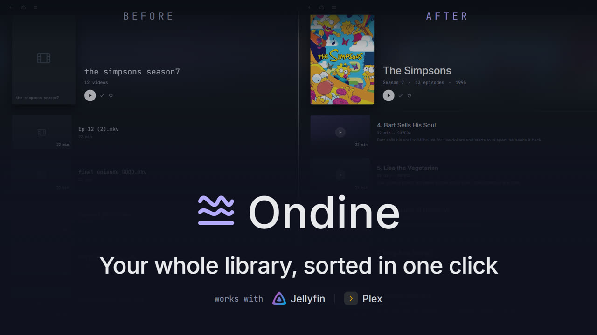

<p align="center">
  
</p>

<h1 align="center">Ondine</h1>

<p align="center">
  <b>The step you run before Plex scans.</b>
</p>

<p align="center">
  Plex, Jellyfin and Kodi show you a beautiful library, but only when the files are already
  named and filed properly. When they are not, those servers give up: the episode shows up as
  «Unknown», the film gets mistaken for another one, or it simply never appears.
  Ondine is the step you run <b>before</b>.
</p>

<p align="center">
  <b>Desktop app for Windows</b> · <b>terminal tool for Linux, macOS and Windows</b>
</p>

<p align="center">
  <a href="README.es.md">Español</a> · <b>English</b>
</p>

---

<p align="center">
  
</p>

<p align="center">
  <i>The same folder, before and after. Left, what the server could make of it; right, what it
  makes of it once Ondine has been through.</i>
</p>

<p align="center">
  <a href="https://ondine.hdglabs.com">
    
  </a>
  <br>
  <i>Forty-four seconds · <a href="https://ondine.hdglabs.com">plays on ondine.hdglabs.com</a></i>
</p>

---

Three things, and all three raise the **quality of the data** in your library:

- **Compress**, so it fits. Typically **80 to 90% smaller** while keeping the picture where it
  should be, using hardware acceleration. Before it starts it shows you a **forecast** of the
  final size, and if you want that sharper it can **measure it for real** by encoding short
  samples. It also knows how to **drop dubs and subtitles without re-encoding**: a 155 MB
  episode falls to 134 MB in 0.6 s, with the video **identical bit for bit**.
- **Organise**, so the server recognises it. It matches every episode in a folder against a
  catalogue and proposes its canonical name. It understands that **one episode can carry several
  stories inside** (`E1a`, `E1b`, `E1c`), knows how to **split it** into separate files, and tells
  you **which episodes you are missing**.
- **Trim**, to remove what does not belong. Split a video into several, or cut a chunk out of it,
  without opening an editor.

**It never touches the originals** unless you explicitly ask it to, and even then they go to the
recycle bin, never to permanent deletion. Everything happens **on your machine**: it sends your
files nowhere.

> What changed in each version: [`CHANGELOG.md`](CHANGELOG.md) · Where it is going:
> [`ROADMAP.md`](ROADMAP.md).

## What it looks like

> The interface is currently in Spanish. English is on the way; the screenshots below are the
> real app, not mock-ups.

**Compress** scans a whole folder and lists the tracks of every video: codec, duration, audio and
subtitle languages. Then it compresses in batch, and the panel on the right forecasts the final
size and the saving.


**Organise** compares the files in a folder against an episode catalogue and proposes a name for
each one, grouped by season. Colour tells you what to trust, and nothing gets renamed until you
approve it.


**Trim** splits a video into several or cuts a piece out. Each segment comes out as its own file,
and the original is only removed if all of them succeed. When the name carries two titles, the
second segment names itself.


## What it can do

- **Real batches.** Explorer-style selection in the table: band drag, `Ctrl`/`Shift`+click,
  `Ctrl+A`. Whatever is selected gets processed. `Del` removes from the list without touching the
  file, and right click opens a menu with more options.
- **Forecast and measurement.** Live estimate of size and saving with a quality-versus-saving
  reading. The *Measure with a sample* button encodes three fragments and gives you the real
  figure, calibrating the rest of the list along the way.
- **It does not get stuck.** If the disk fills up it **pauses** instead of cancelling or hanging,
  and carries on by itself as soon as you free space, keeping the queue intact.
- **Languages and subtitles.** It detects the tracks, sets your preferred language as the default
  one, and drops the ones you do not want to keep.
- **PowerRename-style output renaming**: search and replace with regular expressions, counters,
  date variables and text casing, with a live preview.
- **Ten-second preview** with the current settings, so you can check before launching the batch.
- **Organise: catalogue matching and renaming.** It checks a folder of episodes against a
  catalogue (JSON) and proposes the canonical name for each, identifying them by title even when
  the filename arrives with numbering and download clutter. It marks the state of every file
  (clean, changed or conflicting) and applies in bulk the ones it identifies confidently; anything
  doubtful is left for you to decide, and it never invents. Sort the columns by clicking a header.
- **Trim: split and cut.** Divide a video into several segments or cut a piece out, to separate
  episodes stuck together or remove intros, with a timeline preview.
- **Presets and preferences** per tab, and automatic updates from GitHub.

## Installing

### Windows, desktop app

1. Download the installer from the **[Releases](https://github.com/luishidalgoa/ondine/releases/latest)**
   page: `Ondine-Setup-X.Y.Z.exe`.
2. Run it. It installs **for your user only** (no administrator prompt) and creates a Start menu
   shortcut, and optionally one on the Desktop.
3. The installer is not signed, so Windows SmartScreen may warn you: click
   **More info → Run anyway**.

> **FFmpeg** is the only dependency, and the installer **detects it automatically**. If you do not
> have it, it offers to download and install it alongside the app. There is nothing to configure.

### Linux and macOS, terminal

The graphical interface uses WPF, which only exists on Windows. For every other system there is
`ondine`, which shares **exactly the same engine**. Download the package for your platform from
[Releases](https://github.com/luishidalgoa/ondine/releases/latest) and unpack it:

```bash
tar xzf ondine-linux-x64.tar.gz     # or linux-arm64, macos-arm64, macos-x64
./ondine --help
```

It is a single self-contained binary: you do not need to install .NET. It ships as `.tar.gz`
because that preserves the execute permission, which a bare file loses when downloaded.

On **Windows**, the terminal tool downloads directly as `ondine-windows-x64.exe`, uncompressed.
Careful: that is the CLI, which is a different thing from the `Ondine-Setup-X.Y.Z.exe` installer,
which is the desktop app.

It needs `ffmpeg` and `ffprobe` on the `PATH` (`apt install ffmpeg`, `brew install ffmpeg`).

## Using it

### Desktop app

1. **Source**: pick a folder, or individual files. With *Subfolders* ticked, it walks into the
   seasons.
2. **Analyse**: lists the videos with size, duration, codec and the audio and subtitle languages
   it detected.
3. Adjust the options (they all have a sensible default) or pick a **preset**.
4. Select the videos and hit **Compress selection**. You get live progress, with **Pause** and
   **Stop** available at any moment.

The **main language** (Spanish by default) is marked as the default audio track; the languages you
do not pick are dropped to save space.

### Terminal

```bash
# Compress a whole season to 720p MP4 with 128 kbps audio
ondine comprimir series/ -r --formato mp4 --alto 720 --audio 128 -o compressed/

# See what tracks each video carries
ondine analizar series/ -r

# Measure how much it will really take, without compressing the whole thing
ondine medir episode.mkv --alto 720

# Compress while renaming the output with a counter
ondine comprimir *.mkv --regex --buscar "^" --reemplazar 'S01E${padding=2;start=1} - ' --enumerar
```

`ondine --help` lists every option.

> The command names and flags are in Spanish for now. They are part of the same translation pass
> as the interface.

## Automatic updates

The app checks GitHub for a newer version on startup. If there is one, hitting **Update now**
downloads the installer, runs it and closes the app to complete the update, which replaces the
previous version in place. You can also check by hand with **Check for updates**.

## Development

Requirements: **.NET 9 SDK** and **Inno Setup 6** (`winget install JRSoftware.InnoSetup`).

```powershell
# Run the app in development
dotnet run --project src/Ondine

# Run the terminal tool
dotnet run --project src/Ondine.Cli -- --help

# Build the whole installer (icon + self-contained .exe + Inno installer)
pwsh -File build.ps1
# -> installer/Output/Ondine-Setup-<version>.exe
```

### Publishing a release

Everything builds in the cloud, with no local dependencies:

1. Add the version section to [`CHANGELOG.md`](CHANGELOG.md) (`## [X.Y.Z] - YYYY-MM-DD`).
2. Bump `<Version>` in **both** `.csproj` files (`src/Ondine` and `src/Ondine.Cli`).
3. `git tag vX.Y.Z && git push --follow-tags`.

[GitHub Actions](.github/workflows/build.yml) **checks the CHANGELOG contract first**, that the
section exists, that the versions match and that the categories are valid, and only then builds the
Windows installer and the terminal binaries for Linux, macOS and Windows, attaching everything to
the Release. If the contract is not met, nothing gets published.

### Layout

| Folder | What it is |
|---|---|
| `src/Ondine/` | C#/WPF app. `Engine.cs` is the engine (FFmpeg); the rest is interface and auto-update. |
| `src/Ondine.Cli/` | Cross-platform terminal tool. It links the engine sources, it does not copy them. |
| `installer/` | Inno Setup script. |
| `web/` | The site at [ondine.hdglabs.com](https://ondine.hdglabs.com), on Astro. |
| `spot/` | The forty-four second spot, built as HTML compositions. |
| `make-icon.ps1` | Generates the icon with GDI+. |
| `build.ps1` | Builds everything end to end. |
| `legacy/` | The original PowerShell version the project was born as. |

> **The graphical interface is Windows only** because it uses **WPF**, which has no runtime on
> Linux or macOS. The engine (`Engine`, `Estimator`, `RenameRule`) is portable, and that is exactly
> what the terminal tool reuses. Bringing the full interface to Linux and macOS would mean porting
> it to **Avalonia**.

## How it works

- It detects the tracks with `ffprobe` and reorders the audio to put your preferred language first
  and mark it as default.
- It picks whichever hardware encoder is available (Intel QSV, NVIDIA NVENC, AMD AMF) or falls back
  to the CPU (`libx265`).
- It skips what is already compressed (HEVC/AV1 at a low bitrate) and files that are still
  downloading.
- It always writes to a temporary file and only moves it to the destination when it finishes
  cleanly, so an interruption never leaves a half-written video passing itself off as a good one.

---

<p align="center">
  <i>It used to be called ShrinkStudio.</i>
</p>
