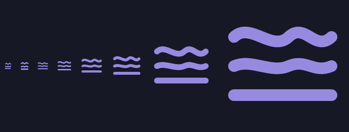

# La marca de Ondine

Tres pasadas horizontales que van de **onda a recta**: lo que entra revuelto sale ordenado. Es la
app en un trazo, y no dice «vídeo» por ningún lado — ni *play*, ni bobina, ni flechas de
compresión, que era exactamente lo que decía el icono anterior.

Es un **trazo abierto, sin contenedor**. Nada de squircle con fondo, ni degradados, ni halos.

## Los ficheros

| Fichero | Para qué |
|---|---|
| `ondine-marca-oscuro.svg` | `#968AE0`, sobre fondo oscuro |
| `ondine-marca-claro.svg` | `#5D5294`, sobre fondo claro |
| `ondine-marca-mono.svg` | `currentColor`, un solo trazo — bandeja, grabado, estampación |
| `ondine-marca-16px.svg` | dibujo de píxel entero, para favicon y bandeja |
| `ondine-lockup-oscuro.svg` | bloque marca + nombre, con espacio de respeto |

## La geometría

Retícula **64**, grosor **6**, extremos y uniones **redondos**. A 16 px el trazo cae en 1,5 px, que
es lo que aguanta nítido en la bandeja del sistema. Al no haber relleno, la versión monocroma es el
mismo dibujo con `currentColor`: no hay una «variante plana» que mantener aparte.

**A 16 px va un dibujo distinto** (`-16px.svg`): retícula de 16, grosor 2, extremos rectos y
vértices en coordenadas enteras — las curvas se vuelven zigzags. Una Bézier a ese tamaño se
difumina en gris y se pierde la progresión onda→recta, que es lo único que sostiene el concepto.
A partir de 24 px se usa siempre la marca normal.

## Dónde se usa, y cómo se regenera

- **Icono de la app** (`src/Ondine/Assets/app.ico`, `app-256.png` y `docs/icon.png`): los genera
  [`make-icon.ps1`](../../make-icon.ps1) con GDI+, sin dependencias externas, y `build.ps1` lo
  ejecuta en cada compilación. **Si cambia el diseño, cambia primero los SVG de aquí y refleja el
  cambio en ese script**, o la próxima build revertirá el icono.
- **Barra de título de la app**: los mismos tres trazos, en `MainWindow.xaml`.

El `.ico` lleva 16, 20, 24, 32, 48, 64, 128 y 256 px. Los dos primeros salen del dibujo de píxel
entero; el resto, de la marca normal.

> **Color del `.ico`**: un solo tono, `#968AE0`, para todos los tamaños. El diseño propone el más
> claro `#B5ABFC` por debajo de 32 px sobre fondo oscuro, pero un `.ico` tiene que sobrevivir
> también a una barra de tareas **clara**, y ahí ese tono se lava (~2:1 sobre blanco). En la barra
> de título de la app sí se usa `#B5ABFC`, porque ahí el fondo siempre es oscuro.

## Cómo se juzga

A 16 px, en una barra de tareas oscura, al lado de Plex, Jellyfin y Sonarr. Si a ese tamaño se
distingue, se recuerda y no parece un reproductor de vídeo, está bien.

---

*Encargo original: [`../brief-logotipo.md`](../brief-logotipo.md). La marca es la dirección
«Corrientes», elegida entre tres y refinada; las otras dos eran «Terrazas» (una onda que se vuelve
escalones) y «Partición» (una cresta cortada en dos).*
